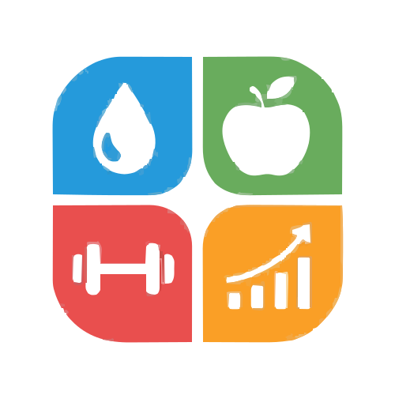
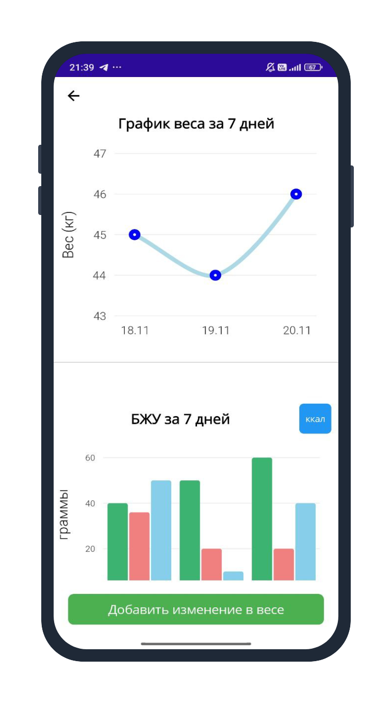

<div align="center">


# 🌿 HealthApp: Your Personal Health Assistant

**A comprehensive, cross-platform health and fitness tracking application built with .NET MAUI.**

[](https://dotnet.microsoft.com/en-us/apps/maui)
[](https://learn.microsoft.com/en-us/dotnet/csharp/)
[](https://www.sqlite.org/)
[](https://opensource.org/licenses/MIT)

*Designed for Android, iOS, Windows, and macOS using a single C# & XAML codebase.*

</div>

<br>

## 📖 About The Project

**HealthApp** is a smart, all-in-one personal health assistant designed to help you achieve your fitness goals. Whether you want to lose weight, gain muscle, or maintain your current shape, HealthApp adapts to your lifestyle. It combines nutrition tracking, dynamic workout planning, hydration monitoring, and an intelligent AI chatbot into a single, intuitive interface.

---

## ✨ Key Features

### 👤 Personalization & Onboarding
HealthApp tailors its recommendations specifically to you. During registration, the app configures your profile based on:
* **Personal Data:** Age, height, weight, and gender.
* **Goals:** Weight loss, weight gain, or maintenance.
* **Lifestyle & Fitness Level:** From sedentary to highly active; beginner to advanced.
* **Preferences:** Available equipment, workout duration, and exercise types (cardio, strength, yoga, etc.).

### 🍏 Nutrition & Calorie Tracking
* **Daily Norm Calculation:** Automatically calculates your daily required Calories, Proteins, Fats, and Carbohydrates (PFC).
* **Meal Journal:** Easily add meals and review your eating history. 
* **Statistics:** Monitor your nutrition and weight progress over the last 7 days via beautiful interactive charts.

### 🏋️‍♂️ Dynamic Workout Management
* **Smart Filtering:** Workouts are dynamically generated based on your goals, available equipment, and preferred duration.
* **Progress Tracking:** Manage your routines with interactive **"To-Do"** and **"Done"** lists.
* **Visual Guides:** Tap on any exercise to view a pop-up image or GIF demonstrating the correct form and technique.

### 💧 Hydration Monitor
* Keep your water balance in check! Log every glass of water to hit your daily hydration target, essential for metabolism and overall health.

### 🤖 Gemini AI Chatbot
Experience the most interactive part of HealthApp! Powered by **Google's Gemini 3.6 flash**, the built-in AI assistant can:
* Analyze the calories and macros of any food/meal.
* Give tips on exercise techniques.
* Provide personalized lifestyle and fitness advice.
* Support Markdown formatting for clean, readable responses.

---

## 🛠️ Tech Stack & Architecture

HealthApp is built following the **MVVM (Model-View-ViewModel)** architectural pattern, ensuring a clean separation of concerns, high performance, and easy maintainability.

* **Framework:** [.NET MAUI](https://dotnet.microsoft.com/en-us/apps/maui) (App.xaml, AppShell.xaml, MauiProgram.cs)
* **UI/UX:** XAML with custom Value Converters (e.g., `BoolToTextConverter`, `RoleToLayoutConverter`, `MarkdownToHtmlConverter`).
* **Data Visualization:** LiveCharts for rendering dynamic weight and macro statistics.
* **Database:** SQLite (Local asynchronous storage).

### 🧠 Core Components Deep Dive

* **DatabaseService (Singleton):** The central hub for local data management. It uses asynchronous SQLite APIs to store, update, and fetch records (`WeightEntry`, `NutritionEntry`, `MealEntry`) without freezing the UI.
* **ViewModels (`ViewModel.cs`):** The brain of the analytics pages. It binds data to the UI, manages state, handles chart configurations (X/Y axes, Series), and instantly updates the view using `INotifyPropertyChanged`.
* **Data Models:** Structured classes like `MealGroup`, `NutritionEntry`, and `GeminiModels` ensure safe data handling between the UI, the local database, and external APIs.
* **exercises.json:** A local embedded database containing rich, structured metadata for every exercise (ID, name, type, gear required, difficulty, image links).

---

## 📸 Screenshots

<div align="center">
  
  &nbsp;&nbsp;
  
  &nbsp;&nbsp;
  
  &nbsp;&nbsp;
  
</div>


---

## 🚀 Getting Started

### Prerequisites
* [Visual Studio 2022](https://visualstudio.microsoft.com/) or JetBrains Rider.
* **.NET MAUI Workload** installed.
* Android SDK / iOS SDK (depending on your target emulator/device).

### Installation
1. **Clone the repository:**
   ```bash
   git clone https://github.com/Kkari3/HealthApp.git
